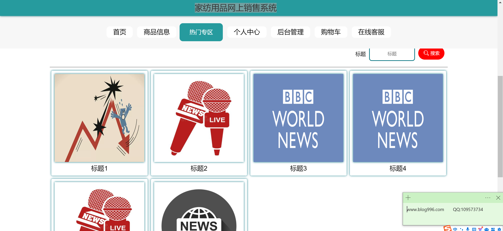
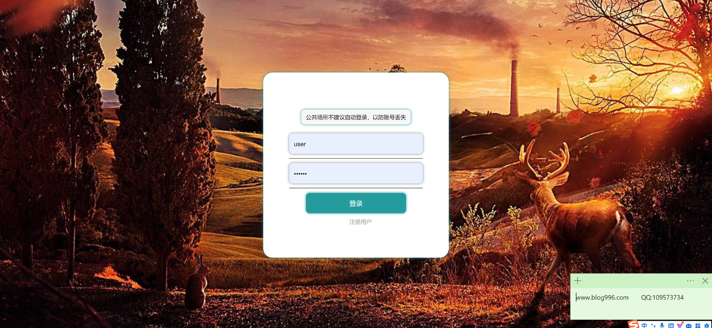

<h1 align="center">家纺用品网上销售管理系统</h1>

## 简介
家纺用品网上销售管理系统：角色分为管理员、普通用户；功能包括用户管理、订单管理、商品分类与信息管理、购物车、个人信息修改、热门专区管理、系统后台管理。    --计算机毕业设计源码；毕设源码；java毕业设计源码

## 联系方式

<h3 align="center">获取完整代码与数据库文件 + 微信：deepguan QQ: 86050149 QQ群: 783742310</h3>

<h3 align="center">可帮忙远程部署 包运行成功！提供远程部署、修改代码、设计文档指导、代码讲解等服务！</h3>

## 功能介绍（完整见运行截图）
管理员： 基本功能：登录，退出 用户管理：管理用户信息，修改权限 家纺用品管理：分类管理，信息管理，热门专区管理 订单管理：查看和管理订单信息，搜索功能 

用户： 基本功能：登录，注册，退出 个人中心：个人信息查看与修改，修改密码 我的订单：查询订单信息，查看购买历史 家纺用品：浏览商品，搜索商品，加入购物车，在线支付 

系统管理： 系统设置，功能模块管理，数据备份与恢复 用户反馈：收集用户意见，处理用户咨询和问题 统计报表：订单统计，用户统计，商品销售数据 

访客： 浏览商品信息，查看热门专区，访问个人中心页面 提交咨询：通过联系信息进行咨询，获取帮助 了解网站：查看网站介绍与功能说明

## 运行截图

本代码来源于网络,仅供学习参考使用!

